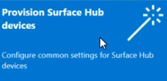
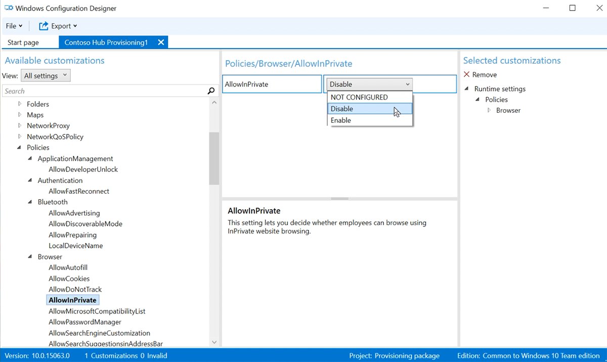

# <a name="create-provisioning-packages-for-surface-hub"></a>Erstellen von Bereitstellungspaketen für Surface Hub

Mit Bereitstellungspaketen können Sie die Bereitstellung wichtiger Features automatisieren und so eine konsistente Oberfläche für alle Surface Hubs in Ihrer Organisation bereitstellen.  Mit Windows Configuration Designer (WCD) auf einem separaten PC können Sie die folgenden Aufgaben ausführen:

- Registrieren bei Active Directory oder Azure Active Directory
- Erstellen eines Geräteadministratorkontos
- Anwendungen und Zertifikate hinzufügen
- Proxyeinstellungen konfigurieren
- Eine Konfigurationsdatei für Surface Hub hinzufügen
- Konfigurieren von [Konfigurationsdienstanbietereinstellungen (Configuration Service Provider, CSP)](/windows/client-management/mdm/surfacehub-csp)

## <a name="overview"></a>Übersicht

1. Installieren Sie auf einem separaten PC, auf dem Windows 10 ausgeführt wird, [Windows Konfigurations-Designer](https://www.microsoft.com/store/apps/9nblggh4tx22) aus dem Microsoft Store.
1. Wählen Sie [**"Bereitstellen Surface Hub Geräte"**](#use-surface-hub-provisioning-wizard) aus, um allgemeine Einstellungen mithilfe eines Assistenten zu konfigurieren. Oder wählen Sie ["Erweiterte Bereitstellung"](#use-advanced-provisioning) aus, um alle möglichen Einstellungen anzuzeigen und zu konfigurieren.
1. Erstellen Sie das Bereitstellungspaket, und speichern Sie es auf einem USB-Laufwerk.
1. Stellen Sie das Paket während des Setups bei der ersten Ausführung oder über die Einstellungen App für Ihre Surface Hub bereit. Weitere Informationen finden Sie unter [Erstellen eines Bereitstellungspakets für Windows 10.](/windows/configuration/provisioning-packages/provisioning-create-package)

## <a name="use-surface-hub-provisioning-wizard"></a>Verwenden Surface Hub Bereitstellungs-Assistenten

1. Öffnen Sie Windows Konfigurations-Designer, und wählen Sie **"Bereitstellung Surface Hub Geräte"** aus.<br>
    
    
2. Benennen Sie Ihr Projekt, und wählen Sie **"Weiter"** aus.

### <a name="add-certificates"></a>Hinzufügen von Zertifikaten

> [!div class="mx-imgBorder"]
> 

Um das Gerät mit einem Zertifikat bereitzustellen, wählen Sie **"Zertifikat hinzufügen"** aus. Geben Sie einen Namen für das Zertifikat ein, und navigieren Sie dann, um das zu verwendende Zertifikat auszuwählen.  Erweiterte Bereitstellungsoptionen finden Sie im Abschnitt unter ["Hinzufügen eines Zertifikats zu Ihrem Paket".](#add-a-certificate-to-your-package)

### <a name="configure-proxy-settings"></a>Proxyeinstellungen konfigurieren

> [!div class="mx-imgBorder"]
> 

1. Umschalten zwischen **Ja** oder **Nein** für Proxyeinstellungen. Standardmäßig erkennt Surface Hub automatisch Proxyeinstellungen. Wenn Ihre Infrastruktur jedoch zuvor die Verwendung eines Proxyservers erfordert hat und diese Anforderung beseitigt hat, können Sie ein Bereitstellungspaket verwenden, um Ihre Surface Hub-Geräte auf die Standardeinstellungen wiederherzustellen, indem Sie **Ja** und **Einstellungen automatisch erkennen** auswählen.
2. Wenn Sie **"Ja"** umschalten, können Sie auswählen, ob Proxyeinstellungen automatisch erkannt oder die Einstellungen manuell konfiguriert werden sollen, indem Sie eine der folgenden Einstellungen eingeben:

    - Eine URL zu einem Setupskript.
    - Eine statische Proxyserveradresse und Portinformationen.

3. Wenn Sie ein Setupskript oder einen Proxyserver verwenden möchten, deaktivieren Sie **"Einstellungen automatisch erkennen".** Sie können ein Setupskript *oder* einen Proxyserver verwenden, nicht beides.
4. Geben Sie Ausnahmen ein (Adressen, mit denen Surface Hub eine direkte Verbindung herstellen sollen, ohne den Proxyserver zu verwenden). **Beispiel:** *.office365.com
5. Identifizieren Sie, ob der Proxyserver für lokale Adressen verwendet werden soll.

### <a name="set-up-device-admins"></a>Einrichten von Geräteadministratoren

 > [!div class="mx-imgBorder"]
 > 

Sie können das Gerät in Active Directory registrieren und eine Sicherheitsgruppe angeben, um die Einstellungs-App zu verwenden und in der Azure Active Directory zu registrieren, sodass globale Administratoren die Einstellungs-App verwenden oder ein lokales Administratorkonto auf dem Gerät erstellen können.

1. Um das Gerät in Active Directory zu registrieren, geben Sie die Anmeldeinformationen für ein Konto mit den geringsten Rechten an, um das Gerät mit der Domäne zu verknüpfen, und geben Sie die Sicherheitsgruppe an, um über die Administratoranmeldeinformationen für Surface Hub zu verfügen. Wenn Sie das Paket auf eine zurückgesetzte Surface Hub anwenden, können Sie dasselbe Domänenkonto verwenden, solange es sich um dasselbe Konto handelt, das die Surface Hub anfangs eingerichtet hat. Andernfalls muss ein anderes Domänenkonto im Bereitstellungspaket verwendet werden.
2. Bevor Sie Windows Configuration Designer verwenden, um die Azure AD-Massenregistrierung zu konfigurieren, [sollten Sie die Implementierung der Azure AD-Verknüpfung planen.](/azure/active-directory/devices/azureadjoin-plan) Die Einstellung **Maximale Anzahl von Geräten pro Benutzer** in Ihrem Azure AD-Mandanten bestimmt, wie oft das Massen-Token im Assistenten verwendet werden kann.
3. Um das Gerät in Azure AD zu registrieren, wählen Sie diese Option aus, und geben Sie einen aussagekräftigen Namen für das Massen-Token ein, das Sie vom Assistenten erhalten. Legen Sie ein Ablaufdatum für das Token fest. (Das Maximum liegt bei 30Tagen ab Erhalt des Tokens.) Wählen Sie **"Massentoken abrufen"** aus. Geben Sie im **Anmeldefenster** ein Konto mit Berechtigungen für die Verknüpfung eines Geräts mit Azure AD und dann das Kennwort ein. Wählen Sie **"Annehmen"** aus, um Windows Konfigurations-Designer die erforderlichen Berechtigungen zu erteilen.
4. Um ein lokales Administratorkonto zu erstellen, wählen Sie diese Option aus, und geben Sie einen Benutzernamen und ein Kennwort ein.

> [!IMPORTANT]
> Wenn Sie ein lokales Konto im Bereitstellungspaket erstellen, müssen Sie mithilfe der App **Einstellungen** alle 42Tage das Kennwort ändern. Wenn das Kennwort innerhalb dieses Zeitraums nicht geändert wird, wird das Konto möglicherweise gesperrt, und eine Anmeldung ist nicht möglich.

### <a name="enroll-in-third-party-mdm-provider"></a>Registrieren bei einem MDM-Drittanbieter

> [!div class="mx-imgBorder"]
> 

Wenn Sie einen Drittanbieter für die mobile Geräteverwaltung (Mobile Device Management, MDM) verwenden, können Sie diesen Abschnitt verwenden, um Surface Hub zu registrieren. Um sich bei Intune zu registrieren, richten Sie zuerst den Azure AD-Beitritt ein, wie im vorherigen Abschnitt beschrieben, und folgen Sie den Anweisungen in der folgenden Intune-Dokumentation: Einrichten der [automatischen Registrierung für Windows 10 Geräte.](/mem/intune/enrollment/quickstart-setup-auto-enrollment)

1. Umschalten **von "Ja"** oder **"Nein"** für die Registrierung in MDM von Drittanbietern.
2. Wenn Sie **"Ja"** umschalten, geben Sie ein Dienstkonto und ein Kennwort oder einen Zertifikatfingerabdruck an, der berechtigt ist, das Gerät zu registrieren und den Authentifizierungstyp anzugeben.
3. Wenn dies von Ihrem MDM-Anbieter erforderlich ist, geben Sie die URLs für den Ermittlungsdienst, den Registrierungsdienst und den Richtliniendienst ein.

 Weitere Informationen finden Sie unter [Verwalten von Surface Hub mit einem MDM-Anbieter.](manage-settings-with-mdm-for-surface-hub.md)

### <a name="add-applications"></a>Hinzufügen von Anwendungen

> [!div class="mx-imgBorder"]
> 

Sie können mehrere Universelle Windows-Plattform (UWP)-Apps in einem Bereitstellungspaket installieren. Weitere Informationen finden Sie unter [Bereitstellen von Apps für PCs.](/windows/configuration/provisioning-packages/provision-pcs-with-apps)

> [!NOTE]
> Obwohl Sie mit Windows Konfigurations-Designer einem Bereitstellungspaket eine klassische Win32-App hinzufügen können, akzeptiert Surface Hub nur UWP-Apps. Wenn Sie eine klassische Win32-App hinzufügen, wird die Bereitstellung fehlschlagen.

### <a name="add-a-configuration-file"></a>Hinzufügen einer Konfigurationsdatei

Zusätzlich zu diesem Bereitstellungspaket können Sie eine Surface Hub Konfigurationsdatei verwenden, um die Einrichtung Ihrer Geräte noch einfacher zu machen. Eine Surface Hub Konfigurationsdatei enthält eine Liste der Gerätekonten zum Herstellen einer Verbindung mit Exchange, Microsoft Teams oder Skype for Business sowie "Anzeigenamen" für die drahtlose Projektion.

**So erstellen Sie eine Surface Hub Konfigurationsdatei:**

1. Öffnen Sie Microsoft Excel (oder einen anderen .csv-Editor), erstellen Sie eine .csv Datei mit dem Namen SurfaceHubConfiguration.csv
2. Geben Sie eine Liste der Gerätekonten und Anzeigenamen in diesem Format ein:

    ```
    <DeviceAccountName>,<DeviceAccountPassword>,<FriendlyName>
    ```

    > [!NOTE]
    > Die Konfigurationsdatei darf keine Spaltenüberschriften enthalten. Wenn sie in einem Bereitstellungspaket enthalten ist, das auf Surface Hub angewendet wird, können Sie das Konto und den Anzeigenamen für das Gerät aus der Datei auswählen. Um die .csv Datei zu erstellen, verwenden Sie entweder ein UPN-Adressformat (rainier@contoso.com) oder ein untergeordnetes Anmeldenamenformat (contoso\regenier).

- rainier@contoso.com,password,Surface Hub

3. Speichern Sie die Datei in Ihrem Projektordner, und kopieren Sie sie mit ihrem Bereitstellungspaket auf den USB-Stick.

> [!NOTE]
> Die Konfigurationsdatei kann nur während der Erstausführungseinrichtung angewendet werden.

### <a name="password-protect-provisioning-package"></a>Bereitstellungspaket zum Kennwortschutz

Wenn Sie sich für die Verwendung eines Kennworts entscheiden, müssen Sie es jedes Mal eingeben, wenn Sie das Bereitstellungspaket auf ein Gerät anwenden.

### <a name="complete-provisioning-wizard"></a>Assistent zum Abschließen der Bereitstellung

Wenn Sie nur allgemeine Einstellungen **** konfigurieren müssen, wählen Sie  >  **"Fertig stellen"** aus, und fahren Sie mit dem Abschnitt ["Paket erstellen"](#build-your-package)fort. Oder setzen Sie die Konfiguration von Einstellungen fort, indem Sie zur erweiterten Bereitstellung wechseln.

## <a name="use-advanced-provisioning"></a>Verwenden der erweiterten Bereitstellung

> [!TIP]
> Verwenden Sie den Assistenten, um ein Paket mit allgemeinen Einstellungen zu erstellen, und wechseln Sie dann zum erweiterten Editor, um weitere Einstellungen hinzuzufügen.<br><br> 

1. Wenn Sie den vorherigen Abschnitt fortsetzen, wählen Sie **"Wechseln zum erweiterten Editor"** aus, andernfalls öffnen **Sie Windows Konfigurations-Designer,** und wählen Sie **"Erweiterte Bereitstellung"** aus.<br>
  

2. Benennen Sie Ihr Projekt, und wählen Sie **"Weiter"** aus.
3. Wählen Sie **"Allgemein" Windows 10 Team**aus, wählen Sie **"Weiter"** und dann **"Fertig stellen"** aus.<br>
     

4. Wählen Sie im Projekt unter **Verfügbare Anpassungen** **allgemeine Teameinstellungen**aus.<br>
     

### <a name="add-a-certificate-to-your-package"></a>Hinzufügen eines Zertifikats zum Paket

Sie können Bereitstellungspakete zum Installieren von Zertifikaten verwenden, mit denen sich das Gerät bei Microsoft Exchange authentifizieren kann.

> [!NOTE]
> Mit Bereitstellungspaketen können Zertifikate nur im Speicher des Geräts (lokaler Computer) und nicht im Benutzerspeicher installiert werden. Wenn In Ihrer Organisation die Installation von Zertifikaten im Benutzerspeicher erforderlich ist, verwenden **Sie** die Hub Einstellungen-App: **Aktualisieren &**  >  **Importzertifikats für Sicherheitszertifikate.**  >  ****
Alternativ können Sie  [**MDM-Richtlinien**](manage-settings-with-mdm-for-surface-hub.md) verwenden, um Zertifikate entweder im Gerätespeicher oder im Benutzerspeicher bereitzustellen.

> [!TIP]
> Der Abschnitt **"ClientCertificates"** gilt für PFX-Dateien mit einem privaten Schlüssel. CER-Dateien für Stammzertifizierungsstellen sollten im Abschnitt **"RootCertificates"** und für Zwischenzertifizierungsstellen im Abschnitt **"CACertificates"** platziert werden.

1. Wechseln **Sie in Windows Configuration Designer**Available  >  **customizations** zu **Laufzeiteinstellungen**  >  **Zertifikate**  >  **ClientCertificates**.
2. Geben Sie eine Bezeichnung für **"CertificateName"** ein, und wählen Sie dann **"Hinzufügen"** aus.
3. Geben Sie das **CertificatePassword** ein.
4. Suchen Sie für **CertificatePath** das Zertifikat, und wählen Sie es aus.
5. Legen Sie **ExportCertificate** auf **False** fest.
6. Wählen Sie für **KeyLocation** die Option **Software only** aus.

### <a name="add-a-uwp-app-to-your-package"></a>Hinzufügen einer UWP-App zu Ihrem Paket

Zum Hinzufügen einer UWP-App zu einem Bereitstellungspaket benötigen Sie das App-Paket (APPX- oder APPXBUNDLE-Dateien) und alle Abhängigkeitsdateien. Wenn Sie die App im Microsoft Store für Unternehmen erworben haben, benötigen Sie auch die *nicht codierte* App-Lizenz. Unter [Verteilen von Offline-Apps](/microsoft-store/distribute-offline-apps) erfahren Sie, wie Sie diese Elemente aus dem Microsoft Store für Unternehmen herunterladen.

**So fügen Sie eine UWP-App hinzu:**

1. Wechseln Sie im Bereich **Verfügbare Anpassungen** zu **Laufzeiteinstellungen** > **UniversalAppInstall** > **DeviceContextApp**.
2. Geben Sie einen **PackageFamilyName** für die App ein, und wählen Sie dann **Hinzufügen**aus. Verwenden Sie aus Gründen der Konsistenz den Paketfamiliennamen der App. Wenn Sie die App im Microsoft Store für Unternehmen erworben haben, finden Sie den Paketfamiliennamen in der App-Lizenz. Öffnen Sie die Lizenzdatei mit einem Text-Editor, und verwenden Sie den Wert zwischen den PFM-Tags.
3. For **ApplicationFile**, select **Browse** to find and select the target app ( .appx or .appxbundle).
4. Wählen Sie für **DependencyAppxFiles** **"Durchsuchen"** aus, um Abhängigkeiten für die App zu suchen und hinzuzufügen. Für den Surface Hub benötigen Sie nur die x64-Versionen dieser Abhängigkeiten.

Wenn Sie die App vom Microsoft Store für Unternehmen erworben haben, müssen Sie die App-Lizenz zu Ihrem Bereitstellungspaket hinzufügen.

**So fügen Sie eine App-Lizenz hinzu:**

1. Erstellen Sie eine Kopie der App-Lizenz, und benennen Sie sie unter Verwendung der Erweiterung **.ms-windows-store-license** um. Benennen Sie beispielsweise "example.xml" in "example.ms-windows-store-license" um.
2. Wechseln Sie in Windows Konfigurations-Designer zu **Verfügbaren Anpassungen**  >  **Laufzeiteinstellungen**  >  **UniversalAppInstall**  >  **DeviceContextAppLicense**.
3. Geben Sie eine **LicenseProductId** ein, und wählen Sie dann **Hinzufügen**aus. Verwenden Sie aus Gründen der Konsistenz die Lizenz-ID der App aus der App-Lizenz. Öffnen Sie die Lizenzdatei mit einem Text-Editor. Verwenden Sie dann im **License-Tag** den Wert im **LicenseID-Attribut.**
4. Wählen Sie den neuen Knoten **LicenseProductId** aus. For **LicenseInstall**, select **Browse** to find and select your renamed license file (example.ms-windows-store-license).

### <a name="add-a-policy-to-your-package"></a>Hinzufügen einer Richtlinie zum Paket

Surface Hub unterstützt eine Teilmenge der Richtlinien im [Konfigurationsdienstanbieter (CSP) für Richtlinien](/windows/client-management/mdm/policy-configuration-service-provider). Einige dieser Richtlinien können mit Windows Konfigurations-Designer konfiguriert werden.

 **So fügen Sie [CSP-Richtlinien](/windows/client-management/mdm/policies-in-policy-csp-supported-by-surface-hub)hinzu:**

1. Wechseln Sie zu **Verfügbaren Anpassungen**  >  **Laufzeiteinstellungsrichtlinien**  >  ****.
2. Wählen Sie die Komponente aus, die Sie verwalten möchten, und konfigurieren Sie die Richtlinieneinstellung entsprechend. Um beispielsweise zu verhindern, dass Mitarbeiter in Surface Hub InPrivate-Website browsen, wählen Sie **AllowInPrivate** und dann **Deaktivieren**aus.  

    > [!div class="mx-imgBorder"]
    > 

### <a name="add-surface-hub-settings-to-your-package"></a>Hinzufügen von Surface Hub-Einstellungen zum Paket

Sie können Ihrem Bereitstellungspaket Einstellungen aus dem [SurfaceHub-Konfigurationsdienstanbieter](/windows/client-management/mdm/surfacehub-csp) hinzufügen.

1. Wechseln Sie zu **Verfügbare Anpassungen**  >  **Common Team Edition Einstellungen**.
1. Wählen Sie die Komponente aus, die Sie verwalten möchten, und konfigurieren Sie die Richtlinieneinstellung entsprechend.
1. Wenn Sie die Konfiguration des Bereitstellungspakets abgeschlossen haben, wählen Sie **Datei**  >  **speichern**aus.
1. Lesen Sie die Warnung, dass Projektdateien vertrauliche Informationen enthalten können, und wählen Sie **"OK"** aus.

### <a name="build-your-package"></a>Erstellen des Pakets

Wenn Sie ein Bereitstellungspaket erstellen, können Sie vertrauliche Informationen in die Projektdateien und die Bereitstellungspaketdatei (PPKG-Datei) aufnehmen. Obwohl Sie die PPKG-Datei verschlüsseln können, werden die Projektdateien nicht verschlüsselt.  Store die Projektdateien an einem sicheren Speicherort ab, oder löschen Sie sie, wenn sie nicht mehr benötigt werden.

1. Öffnen **Sie Windows Konfigurations-Designer-Exportbereitstellungspaket.**  >  ****  >  ****
2. Ändern Sie **den Besitzer** in **DEN IT-Administrator.**  
3. Legen Sie einen Wert für **Paketversion** fest, und wählen Sie dann **Weiter** aus.

> [!TIP]
> Durch Festlegen des Besitzers auf den IT-Administrator wird sichergestellt, dass die Paketeinstellungen die entsprechenden "Rangfolgeneigenschaften" beibehalten und auf Surface Hub wirksam bleiben, wenn andere Bereitstellungspakete anschließend aus anderen Quellen angewendet werden.

> [!TIP]
> Sie können vorhandene Pakete ändern und die Versionsnummer ändern, um zuvor angewendete Pakete zu aktualisieren.

4. Optional: Sie können das Paket verschlüsseln und die Paketsignierung aktivieren:

    1. Wählen Sie **"Paket verschlüsseln"** aus, und geben Sie dann ein Kennwort ein.
    1. Wählen Sie **"Paket**durchsuchen  >  **signieren"** aus, und wählen Sie das Zertifikat nach Bedarf aus.

    > [!IMPORTANT]
    > Es wird empfohlen, ein vertrauenswürdiges Bereitstellungszertifikat in Ihr Bereitstellungspaket einzugeben. Wenn das Paket auf ein Gerät angewendet wird, wird das Zertifikat dem Systemspeicher hinzugefügt, sodass nachfolgende Pakete im Hintergrund angewendet werden können.

5. Wählen Sie **"Weiter"** aus, um den Ausgabespeicherort anzugeben. Standardmäßig verwendet der Windows-Konfigurations-Designer den Projektordner als Ausgabespeicherort. Oder wählen **Sie "Durchsuchen"** aus, um den Standardausgabespeicherort zu ändern. Wählen Sie **Weiter** aus.
6. Wählen Sie **"Build"** aus, um mit dem Erstellen des Pakets zu beginnen. Die Projektinformationen werden auf der Buildseite angezeigt.
7. Wenn ihr Build fehlschlägt, wird eine Fehlermeldung mit einem Link zum Projektordner angezeigt. Überprüfen Sie die Protokolle, um den Fehler zu diagnostizieren, und versuchen Sie erneut, das Paket zu erstellen.
8. Wenn ihr Build erfolgreich ist, werden der Name des Bereitstellungspakets, des Ausgabeverzeichnisses und des Projektverzeichnisses angezeigt. Wählen Sie **"Fertig stellen"** aus, um den Assistenten zu schließen, und wechseln Sie zurück zur Seite "Anpassungen".
9. Wählen Sie  **den Ausgabespeicherort**  aus, um zum Speicherort des Pakets zu wechseln. Kopieren Sie die PPKG-Datei auf einen leeren USB-Speicherstick.

## <a name="apply-a-provisioning-package-to-surface-hub"></a>Anwenden eines Bereitstellungspakets auf den Surface Hub

Es gibt zwei Möglichkeiten zum Bereitstellen von Bereitstellungspaketen für einen Surface Hub. [Während des Assistenten](#apply-a-provisioning-package-during-first-run)für die erste Ausführung können Sie ein Bereitstellungspaket anwenden, das Zertifikate installiert, oder nachdem das Programm für die erste Ausführung abgeschlossen ist, können Sie ein Bereitstellungspaket anwenden, das Einstellungen, Apps und Zertifikate konfiguriert, indem Sie [Einstellungen](#apply-a-provisioning-package-using-settings-app)verwenden.

### <a name="apply-a-provisioning-package-during-first-run"></a>Anwenden eines Bereitstellungspakets bei der ersten Ausführung

> [!IMPORTANT]
> Während des Programms für die erstausführung können Sie nur Bereitstellungspakete verwenden, um Zertifikate zu installieren. Verwenden Sie die **Einstellungs-App**, um Apps zu installieren und andere Einstellungen anzuwenden.

1. Wenn Sie die Surface Hub zum ersten Mal aktivieren, zeigt das Programm für die erstausführung die [**Hi there-Seite**](first-run-program-surface-hub.md)an. Stellen Sie sicher, dass die Einstellungen richtig festgelegt sind, bevor Sie fortfahren.
2. Schließen Sie den USB-Speicherstick, auf dem die PPKG-Datei enthalten ist, an den Surface Hub an. Wenn das Paket im Stammverzeichnis des Laufwerks enthalten ist, wird es vom Programm für die Erstausführung erkannt, und Sie werden gefragt, ob Sie das Gerät einrichten möchten. Wählen Sie **Einrichten** aus.
3. Im nächsten Bildschirm werden Sie aufgefordert, eine Bereitstellungsquelle auszuwählen. Wählen Sie **Wechselmedien** aus, und tippen Sie auf **Weiter**.
4. Wählen Sie das Bereitstellungspaket (*.ppkg), das Sie anwenden möchten, und tippen Sie auf **"Weiter".** Beachten Sie, dass Sie bei der ersten Ausführung nur ein Paket installieren können.
5. Im Programm für die Erstausführung wird eine Zusammenfassung der Änderungen angezeigt, die vom Bereitstellungspaket angewendet werden. Wählen Sie **Ja, hinzufügen** aus.
6. Wenn eine Konfigurationsdatei im Stammverzeichnis des USB-Speichersticks enthalten ist, sehen Sie **Auswählen einer Konfiguration**. Das erste Gerätekonto in der Konfigurationsdatei wird mit einer Zusammenfassung der Kontoinformationen angezeigt, die mit dem Surface Hub angewendet werden.
7. Wählen Sie in **"Konfiguration auswählen"** den zu übernehmenden Gerätenamen und dann **"Weiter"** aus.

Die Einstellungen im Bereitstellungspaket werden auf das Gerät angewendet, und die Windows-Willkommensseite wird abgeschlossen. Nach dem Neustart des Geräts können Sie das USB-Flash-Laufwerk entfernen.

### <a name="apply-a-provisioning-package-using-settings-app"></a>Anwenden eines Bereitstellungspakets mit Einstellungen App

1. Schließen Sie den USB-Speicherstick, auf dem die PPKG-Datei enthalten ist, an den Surface Hub an.
2. Starten Sie in Surface Hub **Einstellungen,** und geben Sie die Administratoranmeldeinformationen ein, wenn Sie dazu aufgefordert werden.
3. Navigieren Sie zu **Surface Hub** > **Geräteverwaltung**. Wählen Sie unter **"Bereitstellungspakete"** die Option **"Bereitstellungspaket hinzufügen oder**  >  **entfernen" aus.**
4. Wählen Sie das Bereitstellungspaket und dann **Hinzufügen** aus.  Wenn Sie dazu aufgefordert werden, geben Sie ihre Administratoranmeldeinformationen erneut ein.
5. Es wird eine Zusammenfassung der anzuwendenden Änderungen angezeigt. Wählen Sie **Ja, hinzufügen** aus.

## <a name="learn-more"></a>Mehr erfahren

- [Herunterladen von Windows Configuration Designer](https://www.microsoft.com/store/apps/9nblggh4tx22)
- [Erstellen eines Bereitstellungspakets für Windows 10](/windows/configuration/provisioning-packages/provisioning-create-package)
- [Verwalten von Surface Hub mit einem MDM-Anbieter](manage-settings-with-mdm-for-surface-hub.md)
