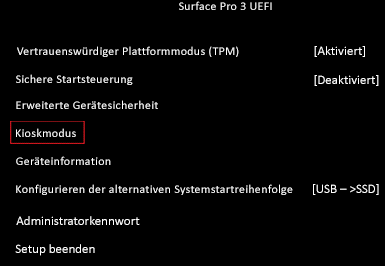

# Einstellungen für Akkulimit

Bei der Option "Akkulimit" handelt es sich um eine UEFI-Einstellung, die ändert, wie der Akku des Surface-Geräts aufgeladen wird und dessen Lebensdauer möglicherweise verlängern kann. Diese Einstellung wird in Fällen empfohlen, in denen das Gerät kontinuierlich mit dem Strom verbunden ist, z. B. wenn Geräte in Kiosklösungen integriert sind.  

## Funktionsweise des Akkulimits

Wenn Sie das Gerät auf "Akkulimit" einstellen, wird das Protokoll zum Aufladen des Akkus des Geräts geändert. Wenn "Akkulimit" aktiviert ist, ist der Akkustand auf 50% der maximalen Kapazität beschränkt. Der in Windows gemeldete Akkustand spiegelt dieses Limit wider. Daher wird angezeigt, dass der Akku bis zu 50% aufgeladen ist und dieses Limit nicht überschreitet. Wenn Sie "Akkulimit" aktivieren, während das Gerät über 50% aufgeladen ist, zeigt das Akkusymbol an, dass das Gerät angeschlossen ist, aber entladen wird, bis das Gerät 50% seiner maximalen Ladekapazität erreicht.  

## Unterstützte Geräte

Die UEFI-Einstellung für das "Akkulimit" ist in die neuesten Surface-Geräte integriert, einschließlich Surface Pro 7+, Surface Pro 7 und Surface Laptop 3. Frühere Geräte erfordern ein [Surface UEFI-Firmwareupdate](manage-surface-driver-and-firmware-updates.md), das über die Windows Update-Website oder über den MSI-Treiber und Firmwarepakete auf der [Surface Support-Website](https://support.microsoft.com/help/4023482/surface-download-drivers-and-firmware-for-surface) verfügbar ist. Aktivieren Sie ["Akkulimit" für Surface-Geräte aktivieren, die für längere Zeit eingeschlossen sein müssen](https://support.microsoft.com/help/4464941) für die spezifische Surface UEFI-Version, die für jedes unterstützte Gerät erforderlich ist. 

## Aktivieren von "Akkulimit" in Surface UEFI (Surface Pro 4 und höher)

Die Einstellung für "Akkulimit" beim Surface UEFI kann durch Starten in Surface UEFI (**Power + Vol Up** beim Einschalten des Geräts) konfiguriert werden. Wählen Sie die **Startkonfiguration** aus, und schalten Sie dann unter **Erweiterte Optionen** die Option **Akkulimitmodus aktivieren** auf **Ein**.  

 

## Aktivieren von "Akkulimit" für Surface Go und Surface Go 2
Die Einstellung für "Akkulimit" beim Surface kann durch Starten in Surface UEFI (**Power + Vol Up** beim Einschalten des Geräts) konfiguriert werden. Wählen Sie die **Startkonfiguration** aus, und verschieben Sie dann unter **Kioskmodus** den Schieberegler nach rechts, um "Akkulimit" auf **Aktiviert** festzulegen.  

 

## Aktivieren von "Akkulimit" in Surface UEFI (Surface Pro 3)

Die Einstellung für "Akkulimit" beim Surface UEFI kann durch Starten in Surface UEFI (**Power + Vol Up** beim Einschalten des Geräts) konfiguriert werden. Wählen Sie **Kioskmodus** aus, wählen Sie **Akkulimit**, und wählen Sie dann **Aktiviert** aus.

 

 

## Aktivieren von "Akkulimit" mit Surface Enterprise Management Mode (SEMM) oder Surface Pro 3 Firmware-PowerShell-Skripts

Das Surface UEFI-Akkulimit steht auch für die Konfiguration über die folgenden Methoden zur Verfügung:

- Surface Pro 4 und höher 
    - [Microsoft Surface UEFI-Konfigurator](https://docs.microsoft.com/surface/surface-enterprise-management-mode)  
    - Surface UEFI Manager PowerShell-Skripts (SEMM_Powershell.zip) in den [Surface Tools für IT-Downloads](https://www.microsoft.com/download/details.aspx?id=46703)
- Surface Pro 3 
    - [SP3_Firmware_Powershell_Scripts.zip](https://www.microsoft.com/download/details.aspx?id=46703)

### Verwenden von Microsoft Surface UEFI-Konfigurator

Um den Akkulimitmodus zu konfigurieren, legen Sie die Einstellung **Kiosk-Außerkraftsetzungen** auf der Konfigurationsseite **Erweiterte Einstellungen** in SEMM (Surface Pro 4 und höher) fest.

### Verwenden von Surface UEFI Manager PowerShell-Skripts

Das Akkulimit-Feature wird über die folgende Einstellung gesteuert:  

`407 = Battery Profile`

**Beschreibung**: Aktives Verwaltungsschema für das Akkunutzungsmuster

**Standard**:  `0` 

Legen Sie dies auf "`1`" fest, um das Akkulimit zu aktivieren.

### Verwenden von Surface Pro 3-Firmwaretools

Das Akkulimit-Feature wird über die folgende Einstellung gesteuert:  

**Name**: BatteryLimitEnable

**Beschreibung**: BatteryLimit

**Aktueller Wert**:  `0` 

**Standardwert**: `0`

**Vorgeschlagener Wert**: `0` 

Legen Sie dies auf "`1`" fest, um das Akkulimit zu aktivieren.

>[!NOTE]
>Um diese Einstellung zu konfigurieren, müssen Sie [SP3_Firmware_Powershell_Scripts.zip](https://www.microsoft.com/download/details.aspx?id=46703) verwenden. 

