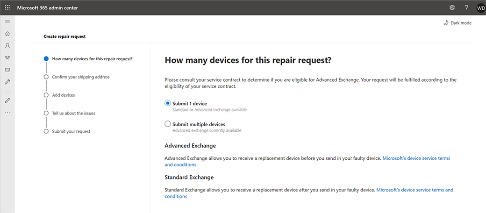
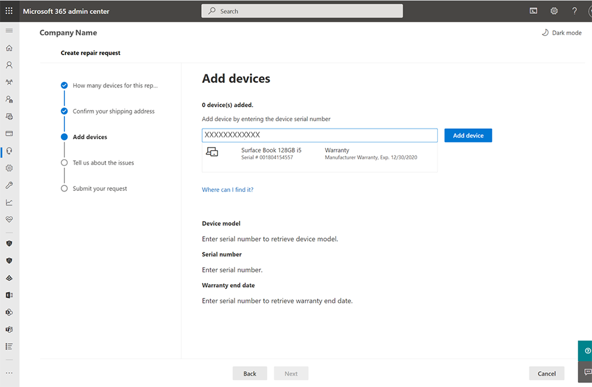
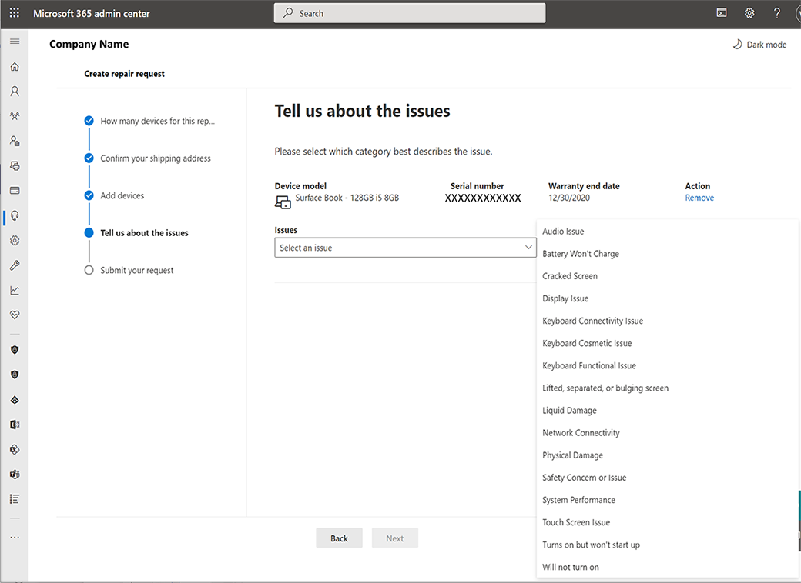

# Surface-Selbstbedienungs-Garantie und -Service

Microsoft 365 Geschäftskunden können den Surface Self Serve Warranty- und Service-Knoten im Microsoft 365 Admin Center verwenden, um Serviceaufträge zu erstellen und zu verwalten. Dieses neue Feature, das als Betaprogramm verfügbar ist, ermöglicht globalen Administratoren die Benennung von Berechtigungen für Personen innerhalb ihres Unternehmens, die für die Unterstützung von Garantie- und Serviceansprüchen verantwortlich sind, einschließlich:

- Hochladen Seriennummern für die Geräte, die dienstpflichtig sind.
- Fügen Sie mehrere Versandadressen hinzu.
- Erstellen Sie einen einzelnen Serviceauftrag für ein oder viele Geräte und Typabdeckungen.
- Anzeigen des Status des Echtzeitdienstauftrags.
- Im Voraus Exchange Massensendungen versenden und empfangen, wenn Für Geräte eine erweiterte Garantie gilt oder advanced Exchange im Rahmen des Gerätekaufs enthalten ist.

## Teilnehmen am Betaprogramm

Wenden Sie sich an Ihren Microsoft Customer Success Account Manager oder Customer Success Manager, um mehr über die Erfahrung und die Teilnahme am Betaprogramm zu erfahren.

## Rollenbasierte Berechtigungen

Die Surface Self-Serve Warranty and Service ermöglicht einem Microsoft 365 globalen Administrator die Möglichkeit, verschiedene Berechtigungen zum Erstellen und Verwalten von Serviceaufträgen zu erteilen, indem er Benutzern Rollen zuweist.

Wenn dem Betaprogramm ein Microsoft 365 Mandant hinzugefügt wird, erhalten die folgenden Administratorrollen zusätzliche Berechtigungen:

| Rolle                  | Berechtigungen                                                                                                                         |
| --------------------- | ----------------------------------------------------------------------------------------------------------------------------------- |
| Globaler Administrator          | Anzeigen von Reparaturanforderungen Erstellen/Verwalten von Reparaturanforderungen Add/Edit/Delete Ship to Address(es) Erstellen/Verwalten von Benutzern und deren Rollen |
| Dienstsupportadministrator | Anzeigen von Reparaturanforderungen Erstellen/Verwalten von Reparaturanforderungen                                                                               |
| Abrechnungsadministrator         | Anzeigen von Reparaturanforderungen Erstellen/Verwalten von Reparaturanforderungen Add/Edit/Delete Ship to address(es)                                        |

Weitere Informationen zu Benutzern und Berechtigungen finden Sie in der [Übersicht über das Microsoft Admin Center.](/microsoft-365/admin/admin-overview/about-the-admin-center)

## Erstellen und Verwalten eines Serviceauftrags

1. Wechseln Sie zum Microsoft 365 Admin [https://admin.microsoft.com](https://go.microsoft.com/fwlink/p/?linkid=2024339) Center, und melden Sie sich mit den entsprechenden Administratorberechtigungen an. Weitere Informationen finden Sie unter [Wer über Administratorberechtigungen in meinem Unternehmen verfügt?](/microsoft-365/business-video/admin-center-overview#who-has-admin-permissions-in-my-business)
2. Wechseln Sie zu **"Surface**Device Repairs unterstützen",  >  **** und wählen Sie **"Reparaturanforderung erstellen"** aus. (Wenn diese Reparaturoption nicht angezeigt wird, verfügen Sie nicht über die Berechtigung, auf diese Seite zuzugreifen.)

    > [!div class="mx-imgBorder"]
    > 

3. Sie können eine Reparaturanforderung für ein oder mehrere Geräte erstellen. Wählen Sie entweder "Gerät nacheinander **übermitteln"** oder **"Mehrere Geräte übermitteln"** aus, um eine .csv Datei zum Hochladen mehrerer Seriennummern zu verwenden, und wählen Sie **"Weiter"** aus.

    > [!NOTE]
    > **Für mehrere Geräte:**
    >
    > - Laden Sie auf der Admin Center-Seite die CSV-Beispielvorlage herunter, fügen Sie die erforderlichen Informationen hinzu, und speichern Sie sie auf Ihrem lokalen Laufwerk.
    > - Wählen Sie **Hochladen CSV-Datei für Masseneinträge**aus, wählen Sie die .csv Datei aus, die Sie auf Ihrem lokalen Laufwerk gespeichert haben, und wählen Sie **"Öffnen" aus.**
    > - Die Seriennummern Ihres Geräts werden hochgeladen. Wählen Sie **"Weiter"** aus, um mit dem Erstellen der Reparatur fortzufahren.

4. Wählen Sie unter **"Versandersetzung an"** eine Versandadresse aus. Oder wählen  **Sie "Neue Adresse hinzufügen"** aus.

    > [!NOTE]
    >
    > - Berechtigungen ermöglichen bestimmten Administratoren das Hinzufügen eines neuen Versands zu Adressen. Wenn Sie über Berechtigungen verfügen, können Sie > neue Adressen hinzufügen. Geben Sie die erforderlichen Informationen ein, und wählen Sie  **"Speichern"** aus.
    > - Das Formular überprüft die Adressinformationen automatisch, und Sie können korrigiert werden, um Änderungen vorzunehmen, wenn die Adresse vom lokalen Postsystem nicht erkannt wird. Die E-Mail-Adresse wird verwendet, um Benachrichtigungen und Kommunikationen für die Reparaturanfrage zu senden.

    > [!div class="mx-imgBorder"]
    > 

5. Fügen Sie das Gerät hinzu, indem Sie die Seriennummer des Geräts in den Textblock eingeben. Weitere Informationen finden Sie unter Seriennummern des [Geräts.](https://support.microsoft.com/help/4036293/surface-find-the-serial-number-on-surface) Wenn die Seriennummer gültig ist, werden ein Bild und Produktinformationen einschließlich Garantiedatum und Modellnummer angezeigt. Wählen Sie **"Gerät hinzufügen"** aus, wenn die Informationen korrekt sind.

    > [!div class="mx-imgBorder"]
    > 

6. Wiederholen Sie die Schritte 1 bis 2, um der Anforderung mehrere Geräte (insgesamt bis zu 20) hinzuzufügen.
7. Wählen Sie im Dropdownmenü den Problemtyp aus, der das Problem am besten beschreibt, und wählen Sie **"Weiter" aus.**

    > [!div class="mx-imgBorder"]
    > 

8. Überprüfen Sie Ihre Bestellung. Wenn informationen falsch sind, wählen Sie **"Zurück"** aus, um Fehler zu korrigieren.
9. Akzeptieren Sie die Geschäftsbedingungen.
10. Wenn die Anforderungszusammenfassung korrekt ist, wählen Sie **"Anforderung übermitteln"** aus.

    > [!div class="mx-imgBorder"]
    > 

Wenn die Startseite angezeigt wird, können Sie Ihre Serviceanfrage in der Zusammenfassungsliste anzeigen und eine Bestätigungs-E-Mail erhalten.

## Häufig gestellte Fragen

### Warum erhalte ich fehlercode 400 "Generic client service error", 401 "Unauthorized service error" oder error 403 "Forbidden service error"?

Möglicherweise liegt ein Problem mit dem Microsoft 365 Konto vor, oder der Benutzer verfügt nicht über die Berechtigungen für den Zugriff auf den Inhalt. Wenden Sie sich an Ihren Microsoft 365 globalen Administrator, um Unterstützung zu erhalten.

### Wenn ich meine Lieferadresse eingibt und eine Fehlermeldung erhalte, dass keine Versandangebote verfügbar sind?

Die Surface Self-Serve Warranty and Service Beta verfügt derzeit über eine eingeschränkte Verfügbarkeit. Angebote sind nur verfügbar, wenn sich die Adresse in einem der folgenden Länder befindet:

Österreich, Amsterdam, Belgien, Belgien, Kroatien, Kroatien, Ungarn, Tschechische Republik, Dänemark, Estland, Finnland, Frankreich, Deutschland, Griechenland, Ungarn, Irland, Italien, Oman, Lettland, Litauen, Luxemburg, Luxemburg, Niederlande, Oman, Polen, Portugal, Rumänien, Slowakei, Slowenien, Südafrika, Spanien, Schweden und Vereinigtes Königreich (ausgenommen Nordirland).

### Wo kann ich Bestellungen sehen, die ich über das Microsoft 365-Portal getätigt habe?

Wechseln Sie zu [Microsoft 365 Admin Center – Dienstanforderungen](https://admin.microsoft.com/Adminportal/Home?source=applauncher#/support/devicerepairs) und melden Sie sich mit Ihren Microsoft 365-Anmeldeinformationen an.

Bestellungen, die über den Microsoft-Kundensupport erstellt wurden, sind im Modul Self-Serve Garantie und Dienstverwaltung nicht sichtbar.

### Warum kann ich keine Lieferadresse hinzufügen, bearbeiten oder löschen?

Die Möglichkeit, eine Lieferadresse hinzuzufügen, zu bearbeiten oder zu löschen, kann nur von Ihrem Microsoft 365 globalen oder Abrechnungsadministrator durchgeführt werden. Wenden Sie sich an sie, um Unterstützung zu erhalten.  

### Wie kann ich den Microsoft-Support für die Surface Self-Serve Warranty and Service Beta kontaktieren?

Sie können sich direkt über das Surface Support-Modul im Microsoft Admin Center an den Support wenden.

1. Melden Sie sich mit Ihren Microsoft 365-Anmeldeinformationen beim Microsoft Admin Center an.
2. Wählen Sie **Support für**Surface  >  **Device Repairs > Benötigen Sie Hilfe?** und beschreiben Sie das Problem.
3. Wenn die Ergebnisse nicht hilfreich sind, wählen Sie **"Support kontaktieren"** aus, und geben Sie eine Beschreibung ihres Problems ein. Bestätigen Sie Ihre Telefonnummer und E-Mail-Adresse, wählen Sie Ihre bevorzugte Kontaktmethode aus, und wählen Sie dann **"Kontakt"** aus.
