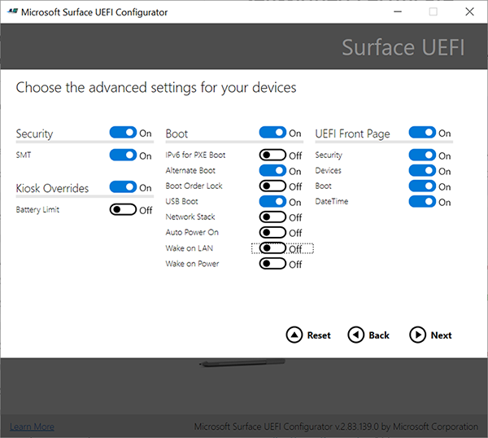

# Wake-On-LAN für Surface-Geräte

Um Geräte vollständig auf dem neuesten Stand zu halten, müssen IT-Administratoren In der Lage sein, Geräte zu verwalten, wenn sie nicht verwendet werden, in der Regel während der Nachtwartungsfenster. Wake on LAN (MAUSTASTE) ermöglicht Administratoren das Remotereaktivieren von Geräten und das automatische Ausführen von Verwaltungsaufgaben mit Microsoft Endpoint Manager- oder Drittanbieterlösungen.

## Anforderungen

Geräte müssen an die Stromversorgung angeschlossen sein und über eine kabelgebundene Verbindung mit einem der folgenden kompatiblen Ethernet-Adapter verfügen:

- Surface USB 3.0-Ethernet-Adapter für Ethernet-Ethernet
- Surface Ethernet-Adapter
- Surface USB-C zu Ethernet und USB-Adapter
- Microsoft USB-C-Reiseadapter-Hub
- Surface Dock
- Surface Dock 2

> [!NOTE]
> Surface Dock 2 bietet die beste Unterstützung für Wake on LAN, ohne dass eine zusätzliche IT-Konfiguration erforderlich ist. Weitere Informationen finden Sie unter ["Wake on LAN" für Surface Dock 2.](wake-on-lan-surface-dock2.md)

## Funktionsweise

Wenn Surface-Geräte nicht verwendet werden, treten sie in einen leerlauffähigen, energiesparend zustandsarmen Zustand ein, der als moderner Standbymodus oder verbundener Standbymodus bezeichnet wird. IT-Administratoren können Geräte mithilfe einer Reaktivierungsanforderung (Paket), die die MAC-Adresse (Media Access Control) des Surface-Zielgeräts enthält, remote auslösen. Viele Verwaltungslösungen, z. B. Microsoft Endpoint Configuration Manager- und Drittanbieter-Microsoft Store-Apps, bieten integrierte Unterstützung für XAML. Weitere Informationen zum Aufwachen von Geräten mit Endpoint Configuration Manager finden Sie unter [Konfigurieren der Aktivierung im LAN – Configuration Manager.](/mem/configmgr/core/clients/deploy/configure-wake-on-lan)

Die Unterstützung für Wake on LAN variiert je nach Ruhezustand: Verbundener Standbymodus oder Ruhezustand (S4-Energiezustand).

## Verbundener Standbymodus

Standardmäßig unterstützt Windows 10 Wake on LAN für Surface-Geräte im verbundenen Standbymodus.

### Unterstützte Surface-Geräte – Verbundener Standbymodus

- Surface Laptop 4 (nur Intel-Prozessoren)
- Surface Laptop 3 (nur Intel-Prozessoren)
- Surface Pro 7+
- Surface Pro 7
- Surface Pro X
- Surface Go 2
- Surface Laptop Gehen
- Surface Book 3

## Ruhezustand

Um Geräte aus dem Ruhezustand zu reaktivieren, muss eine UEFI-Richtlinieneinstellung über [surface Enterprise Management Mode](surface-enterprise-management-mode.md) (SEMM) aktiviert werden (nicht erforderlich für Geräte, die mit Surface Dock 2 verbunden sind).

### Unterstützte Surface-Geräte – Ruhezustand

- Surface Laptop 4 (nur Intel-Prozessoren)
- Surface Laptop 3 (nur Intel-Prozessoren)
- Surface Pro 7+
- Surface Pro 7
- Surface Laptop Gehen
- Surface Book 3

### So aktivieren Sie die UEFI-Einstellung "Wake on LAN"

Um die UEFI-Einstellung "Wake on LAN" zu aktivieren, müssen Sie Zielgeräte bei SEMM registrieren, ein Konfigurationspaket erstellen und das Paket auf die Geräte anwenden. Weitere Informationen finden Sie unter:

- [Surface Enterprise Management-Modus](surface-enterprise-management-mode.md)
- [Registrieren und Konfigurieren von Surface-Geräten mit SEMM](enroll-and-configure-surface-devices-with-semm.md)

1. Laden Sie [**Surface UEFI Configurator**](https://www.microsoft.com/download/details.aspx?id=46703)herunter, und installieren Sie es.
2. Wählen **** Sie  >  **Start Configuration Package**  >  **Create**+ Certificate  > **Protection**aus.
3. Wechseln Sie zu **"Erweiterte Einstellungen",** und wechseln Sie **"Wake on LAN"** zu **"Ein".**
4. Wenden Sie das Paket auf Zielgeräte an.

    > [!div class="mx-imgBorder"]
    > 

## Mehr erfahren

- [Aktivieren von LAN für Surface Dock 2](wake-on-lan-surface-dock2.md)
- [Microsoft Surface USB-C zu Ethernet und USB-Adapter](https://www.microsoft.com/p/surface-usb-c-to-ethernet-and-usb-adapter/8wt81cglrblp?)
- [Surface USB 3.0-Ethernet-Adapter für Ethernet-Ethernet](https://www.microsoft.com/p/surface-usb-30-gigabit-ethernet-adapter/8xn9fqvzbvq0?)
